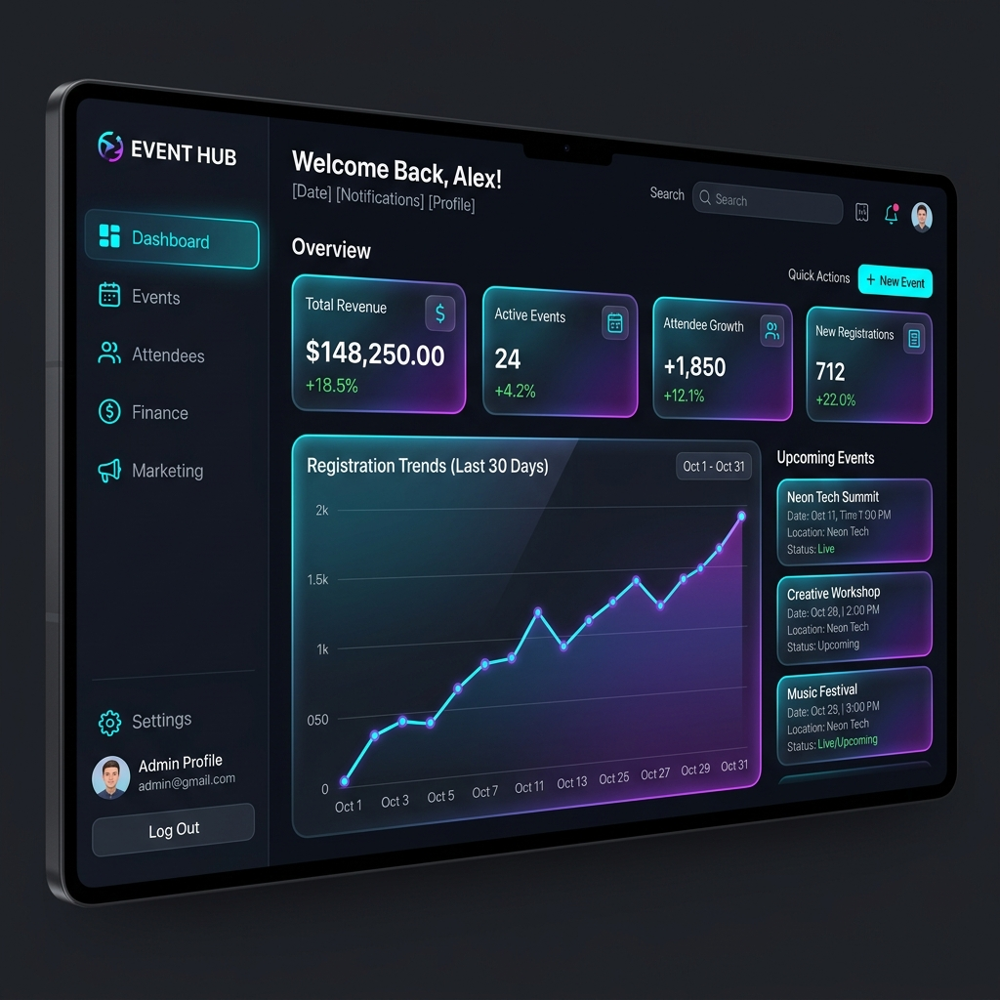

# 🎭 EventHub - Hệ thống Quản lý Sự kiện Toàn diện



**EventHub** là một nền tảng quản lý sự kiện hiện đại, được thiết kế để tối ưu hóa trải nghiệm cho cả **Nhà tổ chức (Organizer)** và **Người tham gia (Attendee)**. Với giao diện tinh tế, hiệu suất cao và bộ tính năng mạnh mẽ, EventHub giúp việc quản lý sự kiện trở nên đơn giản và chuyên nghiệp hơn bao giờ hết.

---

## ✨ Tính năng Nổi bật

### 👔 Dành cho Nhà tổ chức (Organizer)
- **Bảng điều khiển thông minh**: Theo dõi tổng quan doanh thu, số lượng người tham gia và trạng thái các sự kiện theo thời gian thực.
- **Quản lý Sự kiện Chuyên sâu**: Tạo, chỉnh sửa và quản lý vòng đời sự kiện từ lúc bắt đầu đến khi kết thúc.
- **Quản lý Người tham gia**: Danh sách chi tiết, theo dõi check-in và xuất dữ liệu (CSV/Excel).
- **Tài chính & Thanh toán**: Quản lý doanh thu từng sự kiện, lịch sử giao dịch và hệ thống yêu cầu rút tiền minh bạch.
- **Lịch & Timeline**: Giao diện lịch (FullCalendar) trực quan giúp điều phối lịch trình sự kiện dễ dàng.
- **Báo cáo & Phân tích**: Hệ thống mẫu báo cáo linh hoạt, hỗ trợ phân tích dữ liệu chuyên sâu và xuất file đa định dạng (PDF, Excel, CSV).
- **Truyền thông (Broadcast)**: Gửi thông báo nhanh chóng đến toàn bộ người tham gia.

### 👤 Dành cho Người tham gia (Attendee)
- **Khám phá Sự kiện**: Tìm kiếm và tham gia các sự kiện hấp dẫn xung quanh.
- **Quản lý Vé (e-Ticket)**: Hệ thống vé điện tử dựa trên mã QR giúp check-in nhanh chóng và an toàn.
- **Dashboard Cá nhân**: Theo dõi lịch sử tham gia, các sự kiện sắp tới và vé đã mua.
- **Đánh giá & Phản hồi**: Chia sẻ trải nghiệm và đóng góp ý kiến cho các sự kiện đã tham gia.

---

## 🚀 Công nghệ Sử dụng

Dự án được xây dựng trên nền tảng công nghệ hiện đại nhất:

| Category | Technology |
| :--- | :--- |
| **Core** | React 19, Vite, React Router DOM v7 |
| **Styling** | TailwindCSS v4, Material UI (MUI), Framer Motion |
| **Data Viz** | Chart.js, Recharts, React Chartjs 2 |
| **Utility** | Axios, Lucide React, QR Code React |
| **Scheduling** | FullCalendar Suite (@fullcalendar/react) |

---

## 🛠 Hướng dẫn Cài đặt

### Yêu cầu hệ thống
- **Node.js**: Phiên bản >= 18.x (Khuyên dùng LTS)
- **NPM** hoặc **Yarn**

### Các bước thực hiện

1. **Clone dự án**
   ```bash
   git clone <repository-url>
   cd Event-Management-Website/Event-Management-Website
   ```

2. **Cài đặt Dependencies**
   ```bash
   npm install
   ```

3. **Khởi chạy môi trường Phát triển**
   ```bash
   npm run dev
   ```
   Ứng dụng sẽ chạy tại: `http://localhost:5173/`

4. **Đóng gói Production**
   ```bash
   npm run build
   ```

---

## 📂 Cấu trúc Thư mục

```text
src/
├── components/       # Các UI components dùng chung (Modals, Layouts, Tables)
├── pages/            # Các trang giao diện chính (Organizer, Attendee, Public)
├── router/           # Cấu hình định tuyến (AppRouter)
├── assets/           # Tài nguyên tĩnh (CSS, Images)
├── stores/           # Quản lý State (nếu có)
├── App.jsx           # Component gốc
└── main.jsx          # Điểm đầu vào (Entry point)
```

---

## 📝 Quy ước Code

Dự án tuân thủ tiêu chuẩn chất lượng nghiêm ngặt với **ESLint**.
- Kiểm tra lỗi: `npm run lint`

---

© 2026 EventHub Project. Build with ❤️ for better event experiences.
