# 📊 System Diagrams — Event Management Backend

Tập hợp toàn bộ sơ đồ kiến trúc, luồng dữ liệu và thiết kế hệ thống.

---

## 1. System Architecture Diagram

```mermaid
graph TB;

    subgraph Client["Client Layer"]
        FE["React SPA\nlocalhost:5173"];
    end

    subgraph Infra["Infrastructure"]
        NGINX["Nginx Reverse Proxy\nSSL · Rate Limiting · Gzip"];
    end

    subgraph App["Spring Boot Application :8080"]
        direction TB;

        SEC["Spring Security Filter Chain\nJWT · CORS · Rate Limit"];
        CTRL["Controllers\nREST API /api/v1/**"];
        SVC["Service Layer\nBusiness Logic · @Transactional"];
        REPO["Repository Layer\nSpring Data JPA · Specification"];
        DOM["Domain Layer\n@Entity · Enum · Events"];
    end

    subgraph Storage["Storage Layer"]
        PG[("PostgreSQL 16\n:5432")];
        REDIS[("Redis 7\n:6379\nCache · Rate Limit")];
        CDN["Cloudinary\nImage Storage"];
    end

    subgraph Async["Async Processing"]
        EVT["Spring Domain Events\nApplicationEventPublisher"];
        EMAIL["Spring Mail\nSMTP · Thymeleaf"];
        NOTIF["Notification Service"];
    end

    FE -->|HTTPS| NGINX;
    NGINX -->|HTTP :8080| SEC;
    SEC --> CTRL;
    CTRL --> SVC;
    SVC --> REPO;
    REPO --> DOM;
    REPO -->|SQL| PG;
    SVC -->|Cache| REDIS;
    SVC -->|Upload| CDN;
    SVC -->|Publish Event| EVT;
    EVT -->|@Async| EMAIL;
    EVT -->|@Async| NOTIF;
    NOTIF --> REPO;

    style Client fill:#dbeafe,stroke:#3b82f6;
    style App fill:#f0fdf4,stroke:#22c55e;
    style Storage fill:#fef3c7,stroke:#f59e0b;
    style Async fill:#fdf4ff,stroke:#a855f7;
```
---

## 2. Layered Architecture (Chi tiết)

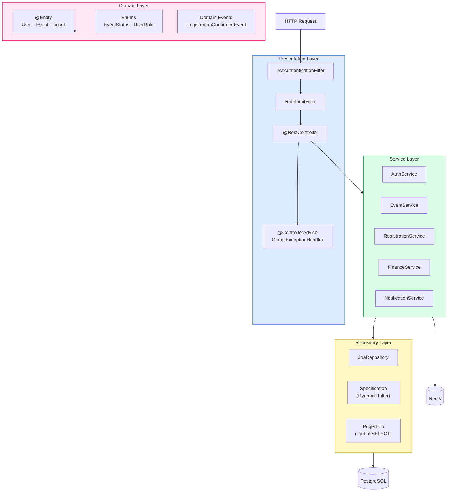

---

## 3. Entity Relationship Diagram (ERD)

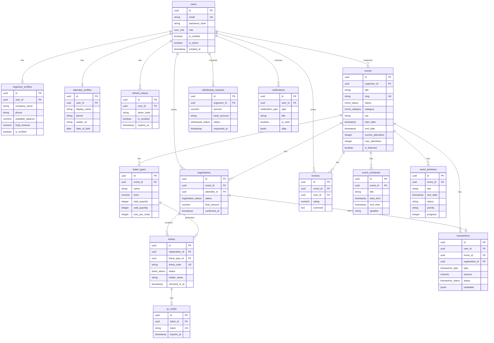

---

## 4. State Machine — Event Status

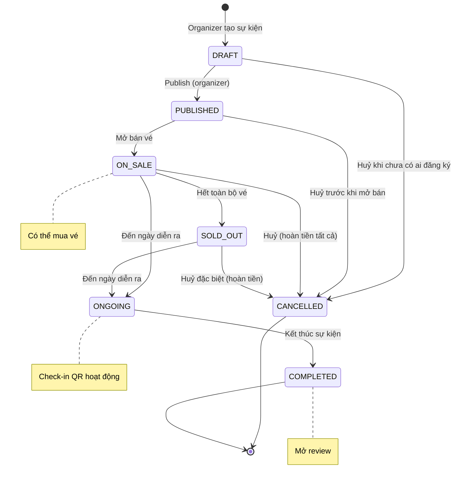

---

## 5. State Machine — Registration & Ticket

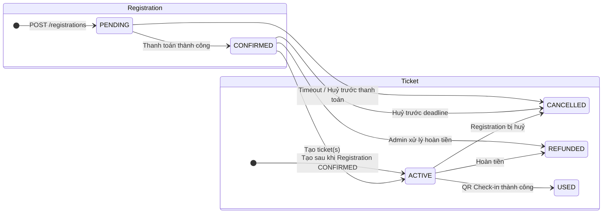

---

## 6. Sequence Diagram — Luồng Mua Vé

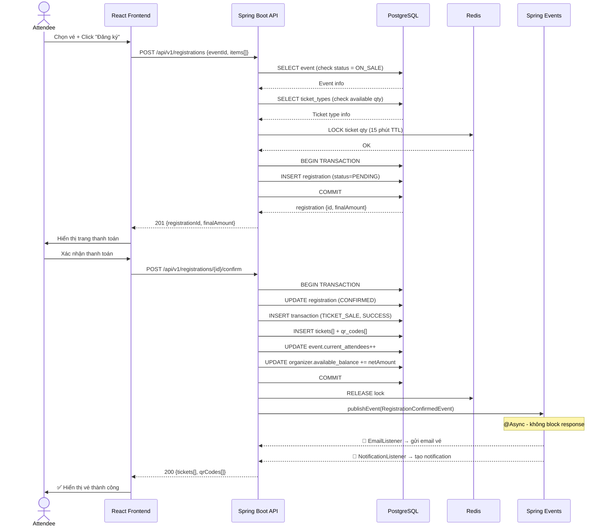

---

## 7. Sequence Diagram — QR Check-in

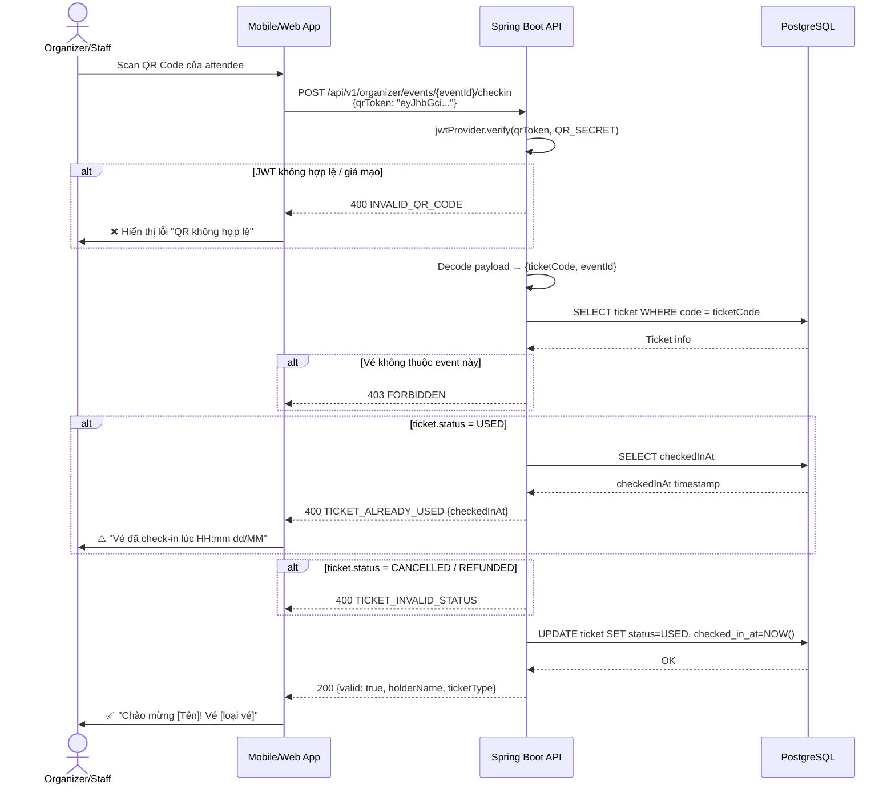

---

## 8. Sequence Diagram — Luồng Rút Tiền

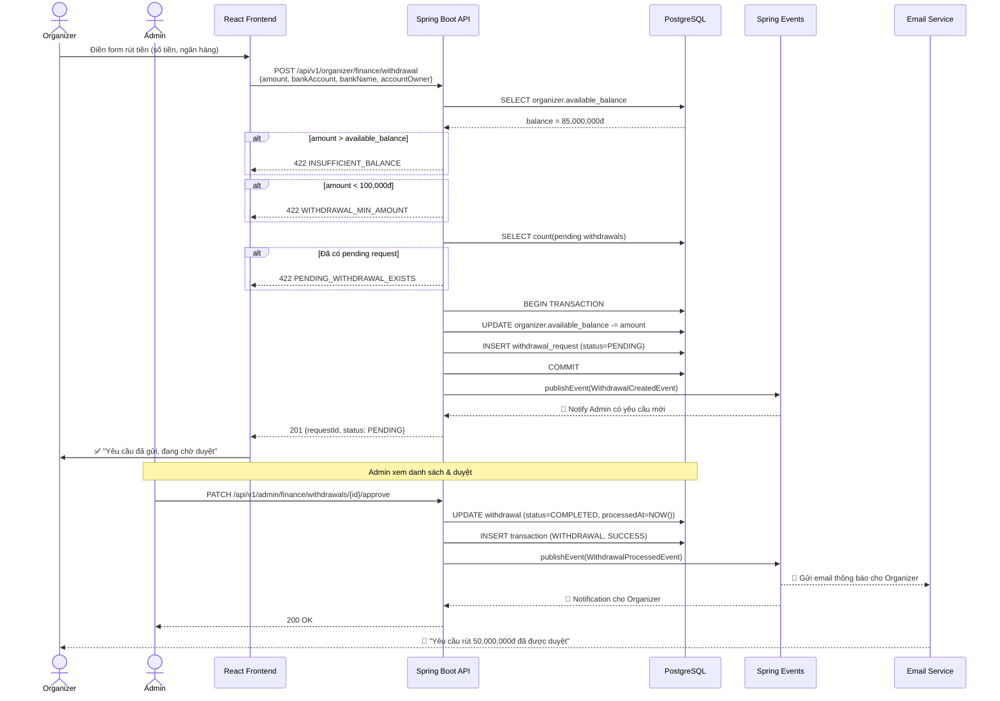

---

## 9. Sequence Diagram — Authentication Flow

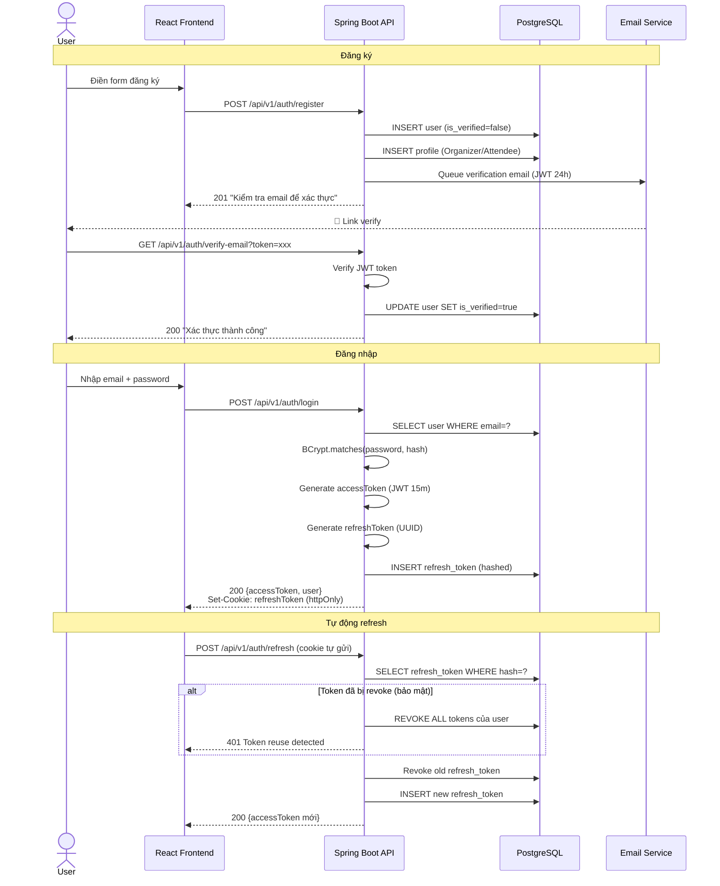

---

## 10. Component Diagram — Security Filter Chain

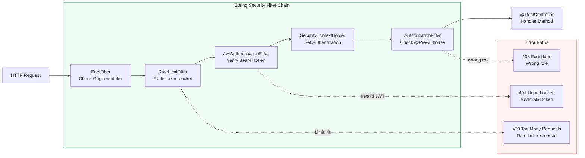

---

## 11. Class Diagram — Core Domain

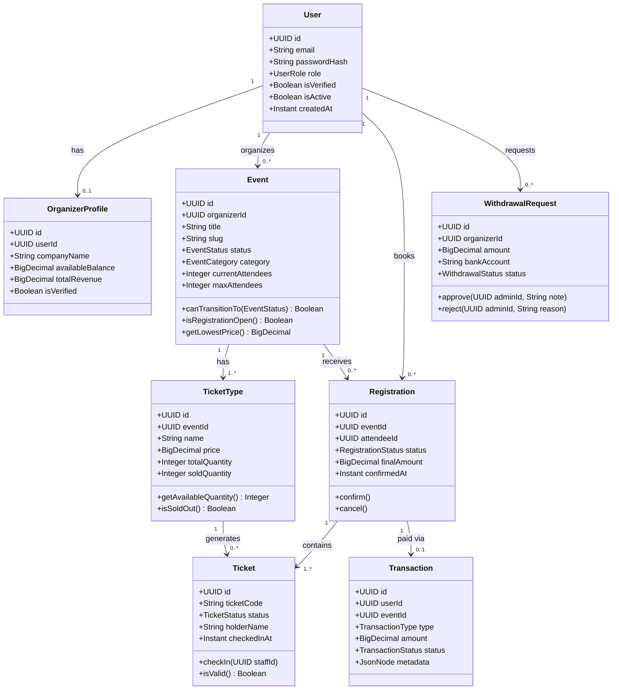

---

## 12. Package/Module Dependency Diagram

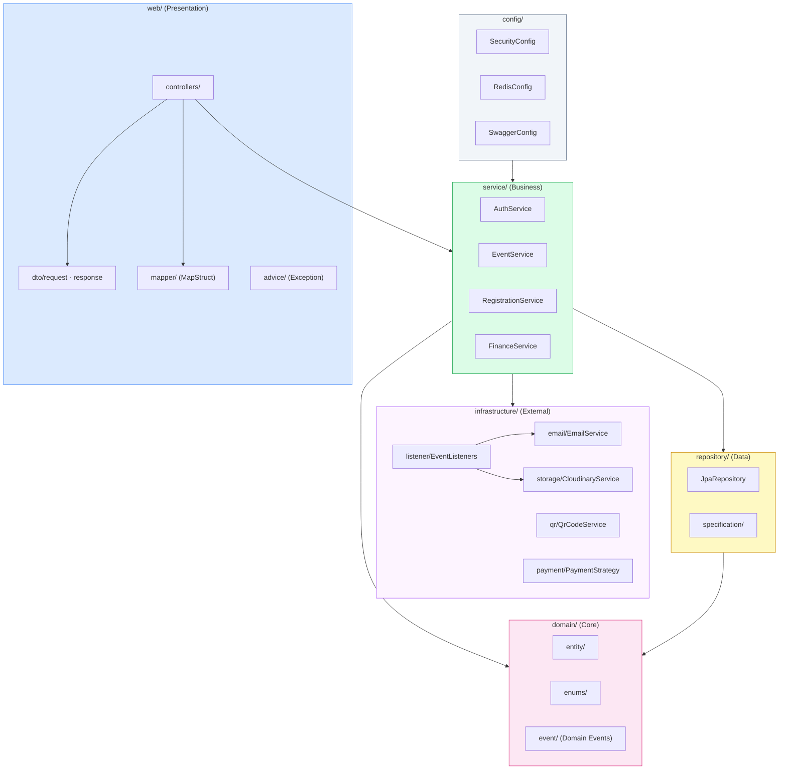
